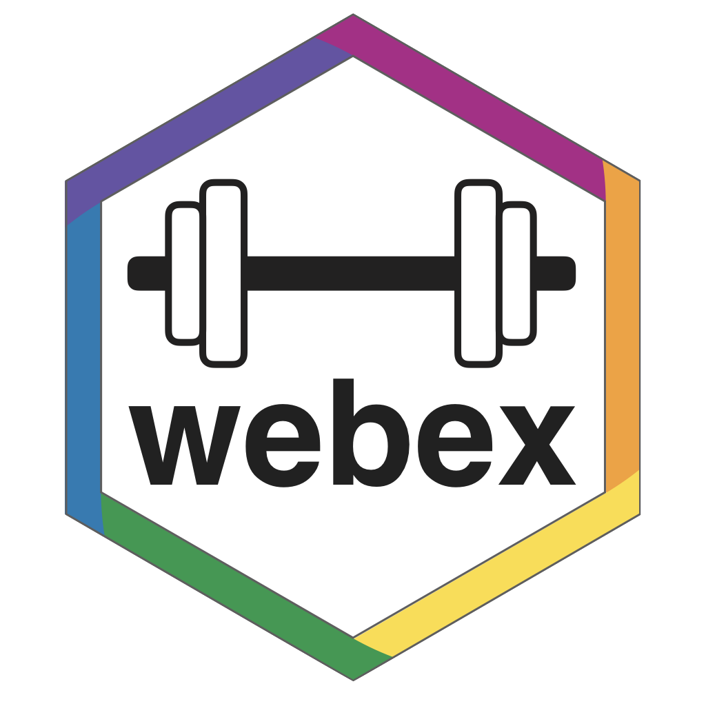

R can be used for more than just stats. You can use it for generating course materials, creating and grading multiple-choice tests, computer-assisted assessment, personalised exam feedback, and student websites. Shiny apps are also a powerful way to demonstrate statistical concepts. But R definitely isn't the only tool for reproducible research. We'll also discuss other tools for teaching reproducible research skills, such as the OSF, git, and GitHub.

<div style="max-width: 25%; float: right;"> 
```{r webex, echo = FALSE}

```
</div>

* [webex](https://github.com/psyteachr/webex)
* [assessr](https://github.com/dalejbarr/assessr)
* [markr](https://github.com/debruine/markr)
* [course book template](https://psyteachr.github.io/book-template/)
* [webpage tutorial](https://gupsych.github.io/acadweb/)
* [OSF](https://osf.io)
* [GitHub/RStudio Quick Setup](https://debruine.github.io/tutorials/setup-git.html)
* [Shiny Tutorials](https://psyteachr.github.io/shiny-tutorials/)