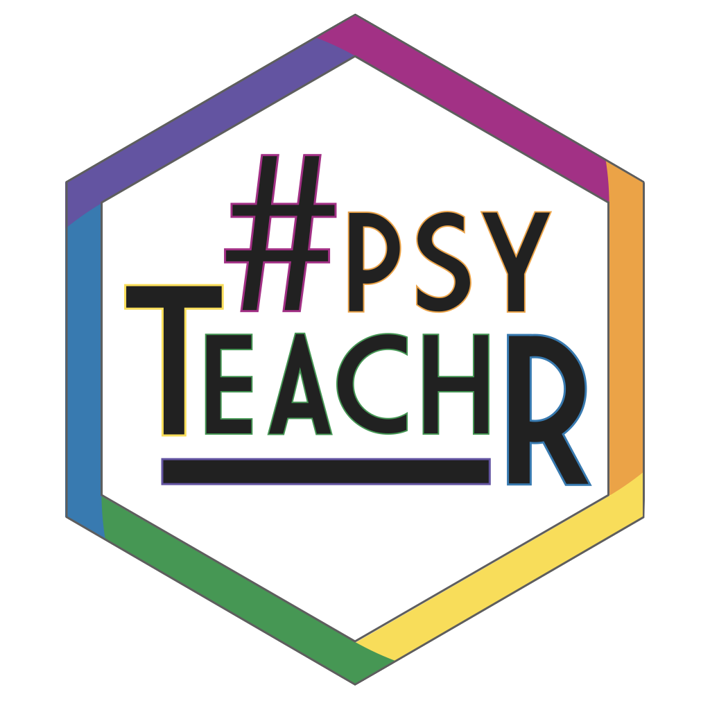

```{r opts, echo = FALSE}
#suppress the warnings and other messages from showing in the knitted file.
knitr::opts_chunk$set(
  fig.width  = 8, 
  fig.height = 5, 
  fig.path   = 'images/',
  echo       = TRUE, 
  warning    = FALSE, 
  message    = FALSE,
  cache      = TRUE
)
```

SIPS2019 workshop  
Location: Amalia in Engels  
Day/time: Sunday 13.45 - 17.15

<div style="max-width: 25%; float: right;"> 
```{r psyteachr, echo = FALSE}

```
</div>

At Glasgow our PsyTeachR teaching team has successfully made the transition to teaching R across all undergraduate and postgraduate levels. In this workshop we will share our experiences, insights, and teaching materials. Our curriculum now emphasises certain essential ‘data science’ graduate skills that have been overlooked in traditional approaches to teaching, including programming skills, data visualisation, data wrangling and reproducible reports. Students learn about probability and inference through data simulation as well as by working with real datasets. We have also instituted regular coursework across all levels, so that students build their skills through practical experience. We will discuss the challenges associated with implementing this new approach, including staff re-training, supporting student learning through online help sessions, and computer-assisted assessment to handle large volumes of coursework. The workshop is aimed at those interested in making the transition to teaching reproducible research in R at their own institutions, although we also would welcome participation from institutions where R is already a core part of the curriculum.

## Schedule

|       |                                       |
|:------|:--------------------------------------|
| 13:45 - 14:00 | **Welcome & Introductions** | 
| 14:00 - 14:20 | **Upgrade your curriculum for reproducibility** |
|               | The traditional research methods curriculum in psychology is failing to produce researchers with the skills needed to work reproducibly and transparently. Researchers need to know not only how to extract insights from data and communicate them to others, but also how to document every step of the analysis process. Moreover, they need technical skills that scale up to meet the challenges of real-world datasets, which can be noisy, large, and inconsistent. We can deliver these skills to students by teaching them how to code. Students who learn to code go on to become more competent, independent, and confident researchers. |
| 14:20 - 14:50 | **Responsible Research Methods v2.0: The Next Generation** | 
|               | We will outline how we redeveloped our research methods teaching from the ground up to immerse students in this goal from day one. We will demonstrate our tools and approach and at the same time highlight the importance of a supportive and inclusive community in shaping and developing a large and diverse student cohort.| 
| 14:50 - 15:00 | **Q & A / Break** | 
| 15:00 - 15:30 | **“Psych students just can’t code”: CHALLENGE ACCEPTED** | 
|                |There is an internalised belief that it is not possible to teach psychology students to code. Rebecca and Shannon challenge this belief through discussing their own personal experience of moving from SPSS to R in the middle of their undergraduate degrees, as well as their experience of supporting the next generation of psychologists to develop data skills for reproducible science.| 
| 15:30 - 15:45 | **Short courses / diverse skill levels** | 
| 15:45 - 16:00 | **Tools for teaching**  | 
|               | R can be used for more than just stats. You can use it for generating course materials, creating and grading multiple-choice tests, computer-assisted assessment, personalised exam feedback, and student websites. Shiny apps are also a powerful way to demonstrate statistical concepts. But R definitely isn’t the only tool for reproducible research. We’ll also discuss other tools for teaching reproducible research skills, such as the OSF, git, and GitHub. ([resources](05_tools.html)) | 
| 16:00 - 17:00 | **Breakout sessions** | 
|               | We'll break into groups to discuss problems and solutions around specific topics of interest, such as teaching assistant experiences, assessment, methods change for a single course, teaching first- and second-years, masters programmes, staff training, tech stuff, and anything else you want to discuss. | 
| 17:00 - 17:15 | **Closing discussion** |