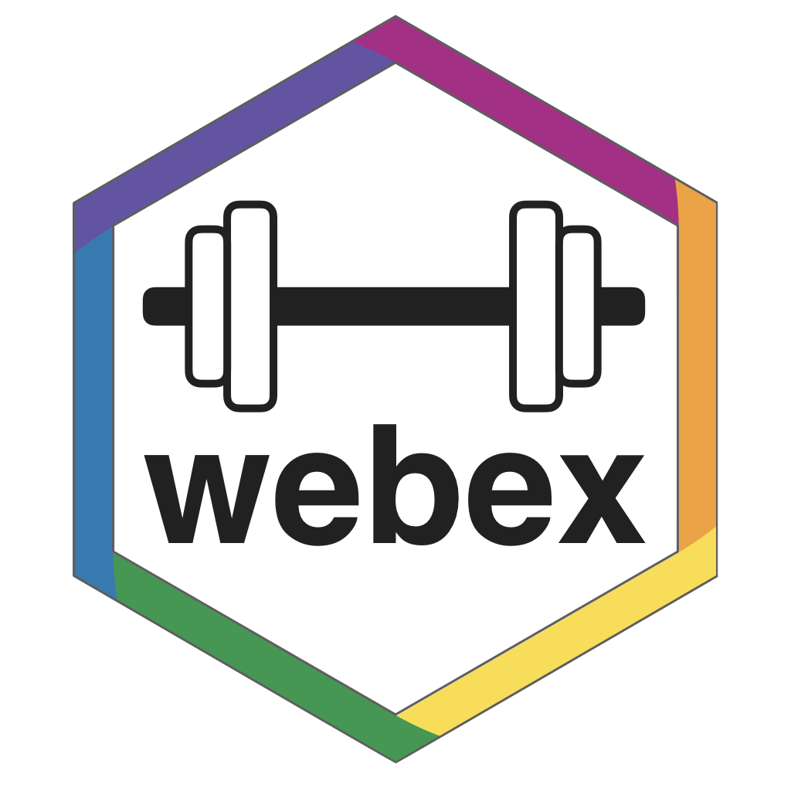
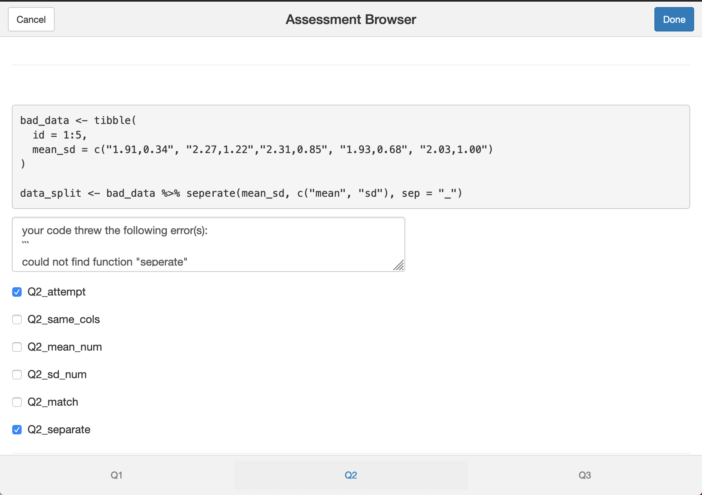
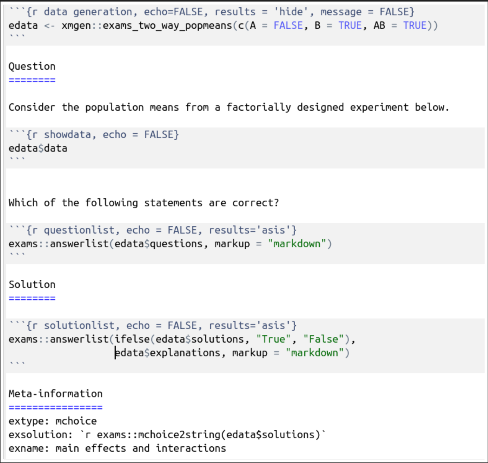
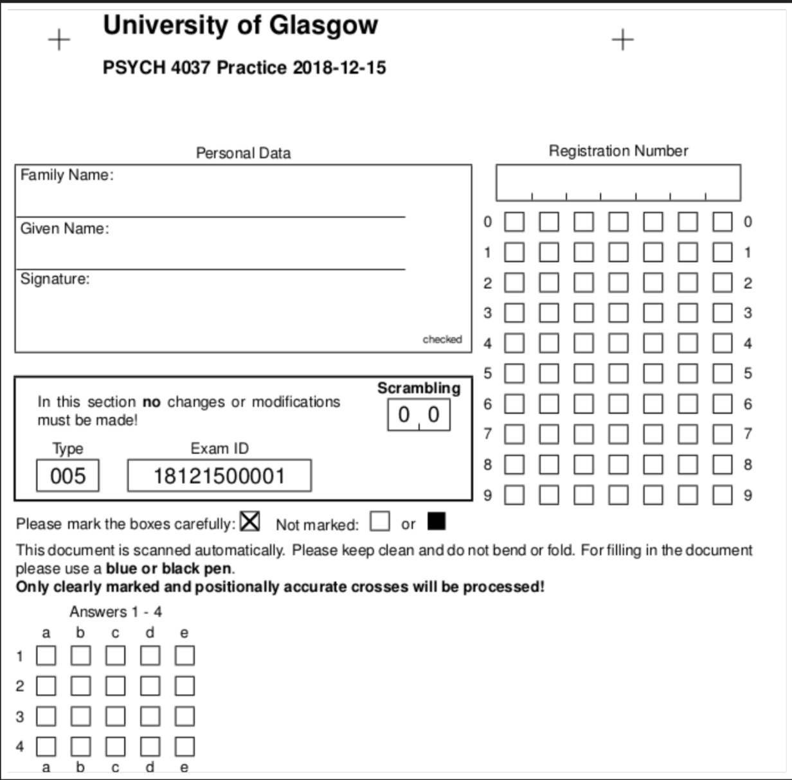
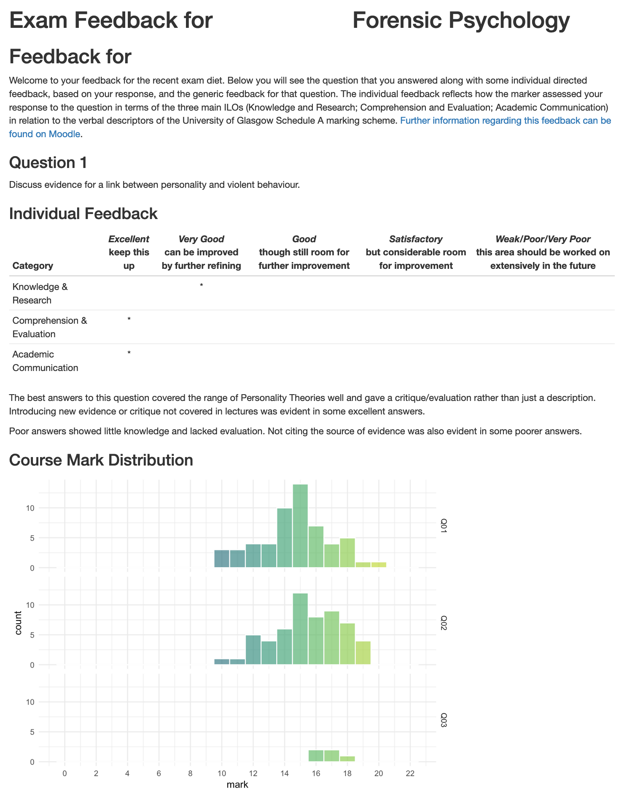
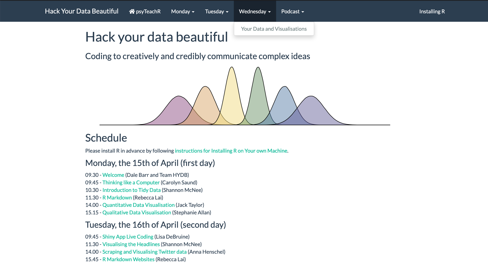
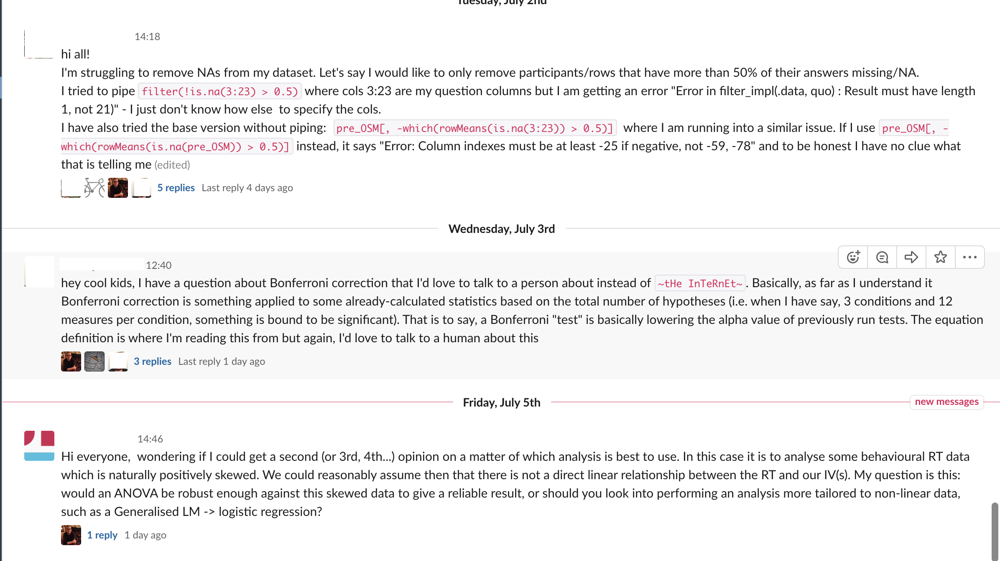
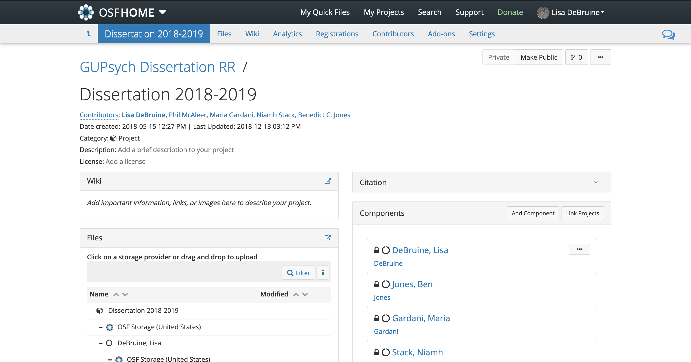
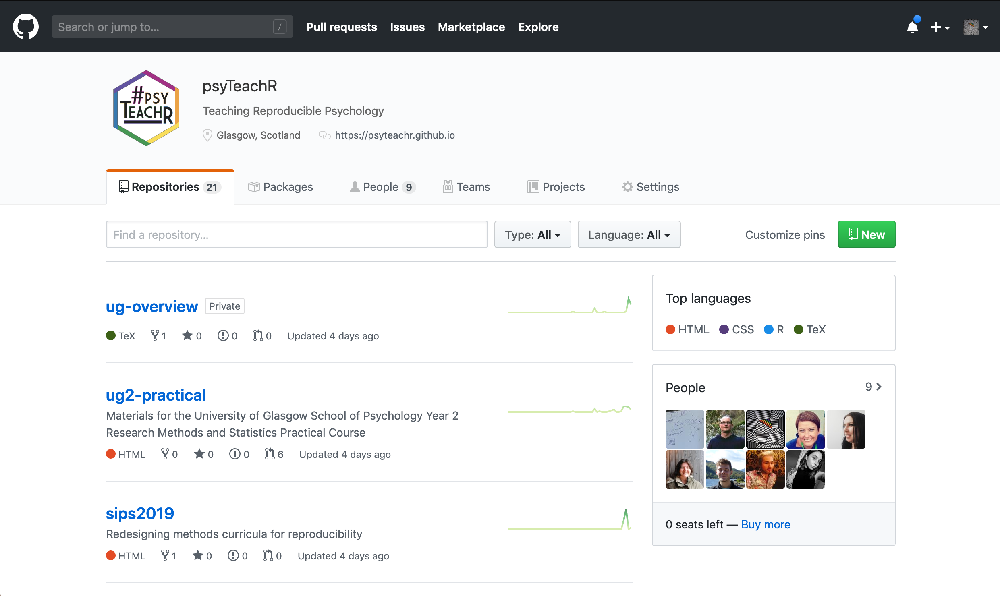

Tools for teaching
========================================================
author: Lisa DeBruine
date: 2019 July 7
autosize: true
font-import: https://webfonts.ffonts.net/Market-Deco.font
css: tools.css


R can be used for more than just stats. You can use it for generating course materials, creating and grading multiple-choice tests, computer-assisted assessment, personalised exam feedback, and websites. Shiny apps are also a powerful way to demonstrate statistical concepts. But R definitely isn't the only tool for reproducible research. We'll also discuss other tools for teaching reproducible research skills, such as Slack, the OSF, git, and GitHub.

Course Materials: Bookdown
========================================================
type: pink


[psyTeachR course book template](https://psyteachr.github.io/book-template/)


Web Exercises: Webex
========================================================
type: orange



<https://github.com/psyteachr/webex>


### Fill in the blank

- Type a vowel: <input class='solveme nospaces ignorecase' size='1' data-answer='["A","E","I","O","U"]'/>

### Multiple choice

- "Never gonna give you up, never gonna: <select class='solveme' data-answer='["let you down"]'> <option></option> <option>let you go</option> <option>turn you down</option> <option>run away</option> <option>let you down</option></select>"
- "I <select class='solveme' data-answer='["bless the rains"]'> <option></option> <option>bless the rains</option> <option>guess it rains</option> <option>sense the rain</option></select> down in Africa"
- "There's nothing that a hundred men <select class='solveme' data-answer='["or more"]'> <option></option> <option>on Mars</option> <option>or more</option> <option>named Marv</option></select> could ever do"


Assisted Assessment: Assessr
========================================================
type: green

<https://github.com/dalejbarr/assessr>




Multiple-Choice Tests: R-exams
========================================================
type: blue


<http://www.r-exams.org/>




Exam Feedback: markr
========================================================
type: purple

<https://github.com/debruine/markr>


```r
all_feedback(
  markfile = "MARKING/1Q",
  id_col = "Student ID",
  moodlefile = "moodle.csv",
  evalfile = "_eval.csv",
  template_file = "_template_1Q.Rmd",
  moodle_dir = "ID_*"
)
```

***




Websites: RMarkdown/Blogdown
========================================================
type: pink


<https://gupsych.github.io/acadweb/>




Interactive Apps: Shiny
========================================================
type: orange


<https://psyteachr.github.io/shiny-tutorials/>

[PlotDemo](http://shiny.psy.gla.ac.uk/debruine/plotdemo/)

[Multilevel Models](http://shiny.psy.gla.ac.uk/Dale/multilevel/)

[WordCloud](http://shiny.psy.gla.ac.uk/debruine/wordcloud/)

[Simulating for LMEM](http://shiny.psy.gla.ac.uk/lmem_sim/)


Community Communication: Slack
========================================================
type: green


<https://slack.com/>




Archiving/Documentation: OSF
========================================================
type: blue


<https://osf.io>




Version Control: Git/GitHub
========================================================
type: purple


<https://github.com>




<script>

/* update total correct if #total_correct exists */
update_total_correct = function() {
  if (t = document.getElementById("total_correct")) {
    t.innerHTML =
      document.getElementsByClassName("correct").length + " of " +
      document.getElementsByClassName("solveme").length + " correct";
  }
}

/* solution button toggling function */
b_func = function() {
  var cl = this.parentElement.classList;
  if (cl.contains('open')) {
    cl.remove("open");
  } else {
    cl.add("open");
  }
}

/* function for checking solveme answers */
solveme_func = function(e) {
  var real_answers = JSON.parse(this.dataset.answer);
  var my_answer = this.value;
  var cl = this.classList;
  if (cl.contains("ignorecase")) {
    my_answer = my_answer.toLowerCase();
  }
  if (cl.contains("nospaces")) {
    my_answer = my_answer.replace(/ /g, "");
  }
  
  if (my_answer !== "" & real_answers.includes(my_answer)) {
    cl.add("correct");
  } else {
    cl.remove("correct");
  }

  // match numeric answers within a specified tolerance
  if(this.dataset.tol){
    var tol = JSON.parse(this.dataset.tol);  
    var matches = real_answers.map(x => Math.abs(x - my_answer) < tol)
    if (matches.reduce((a, b) => a + b, 0) > 0) {
      cl.add("correct");
    } else {
      cl.remove("correct");
    }  
  }

  // added regex bit
  if (cl.contains("regex")){
    answer_regex = RegExp(real_answers.join("|"))
    if (answer_regex.test(my_answer)) {
      cl.add("correct");
    }  
  }
  
  update_total_correct();
}

window.onload = function() {
  /* set up solution buttons */
  var buttons = document.getElementsByTagName("button");

  for (var i = 0; i < buttons.length; i++) {
    if (buttons[i].parentElement.classList.contains('solution')) {
      buttons[i].onclick = b_func;
    }
  }
  
  /* set up solveme inputs */
  var solveme = document.getElementsByClassName("solveme");

  for (var i = 0; i < solveme.length; i++) {
    /* make sure input boxes don't auto-anything */
    solveme[i].setAttribute("autocomplete","off");
    solveme[i].setAttribute("autocorrect", "off");
    solveme[i].setAttribute("autocapitalize", "off"); 
    solveme[i].setAttribute("spellcheck", "false");
    solveme[i].value = "";
    
    /* adjust answer for ignorecase or nospaces */
    var cl = solveme[i].classList;
    var real_answer = solveme[i].dataset.answer;
    if (cl.contains("ignorecase")) {
      real_answer = real_answer.toLowerCase();
    }
    if (cl.contains("nospaces")) {
      real_answer = real_answer.replace(/ /g, "");
    }
    solveme[i].dataset.answer = real_answer;
    
    /* attach checking function */
    solveme[i].onkeyup = solveme_func;
    solveme[i].onchange = solveme_func;
  }
  
  update_total_correct();
}

</script>
