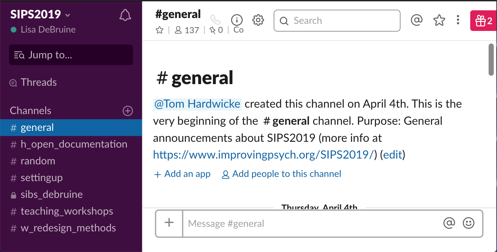
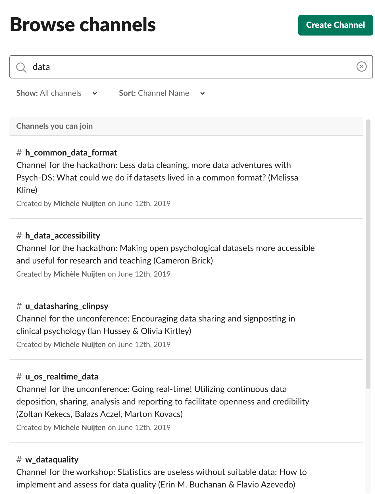
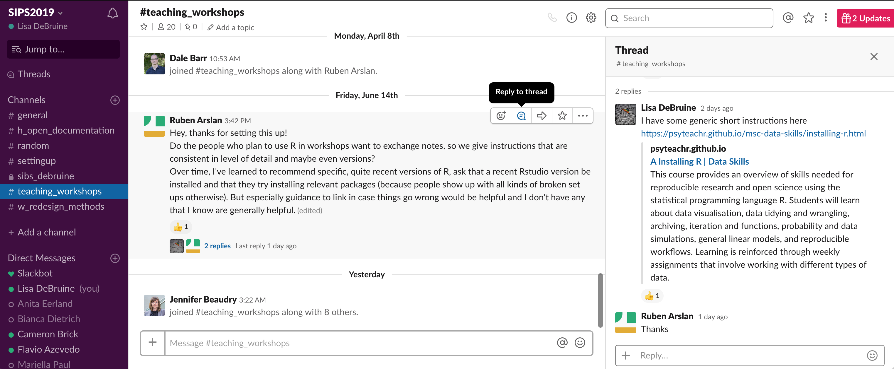
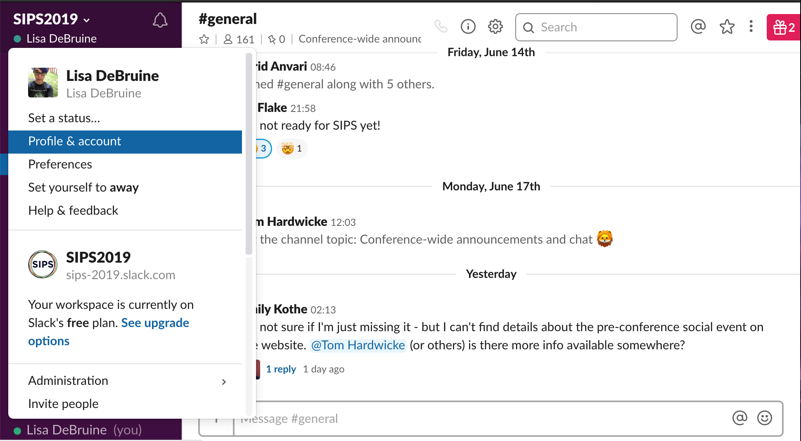
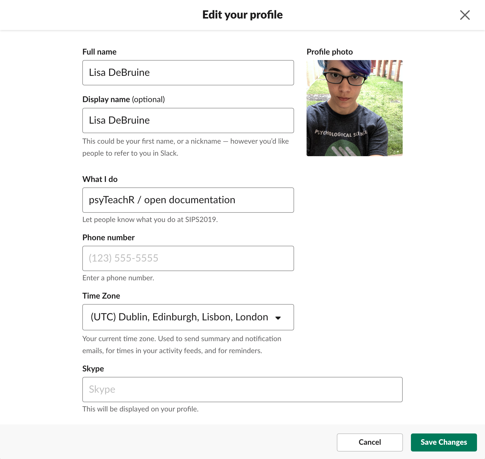

[Suggest additions to this document](https://github.com/PsyTeachR/sips2019/blob/master/slack.Rmd)

[Slack](https://slack.com/) is a social messaging app that is great for team communication. You can make public or invite-only **workspaces** that consist of **channels** that can be joined by anyone on the workspace or kept private. At Glasgow we have one workspace for staff and one for staff and students.

### Create or join a workspace

If you want to make a new workspace or join an existing workspace, go to [Slack Getting Started](https://slack.com/intl/en-gb/get-started) or the URL for the workspace, such at the [SIPS 2019 Slack](https://sips-2019.slack.com). You can download mobile or desktop apps, or use it through the web browser.

When you join a workspace, you'll probably be added to the *general* and *random* channels by default. Most workspaces use *general* for group-wide announcements and *random* for chat. But you can see what the channel is meant to be used for at the top of the channel.

```{r channel-purpose, echo=FALSE, fig.cap="Channel Purpose", out.width="500px", fig.align='center'}



```


### Joining or adding new channels

<div class="floatright">
```{r channel-list, echo=FALSE, fig.cap="Channel List", out.width="400px", fig.align='center'}



```
</div>

Click on **Channels** in the lefthand menu to browse the existing channels, or click the plus to create a new channel (unless the workspace owner has limited channel creation to only some members). A new channel can be public or private. Either way, you can invite other people to the channel by searching for them if they are already workspace members, or inviting them if they are not. Invitations are usually easier to do in the desktop web app and don't always work in the apps.

### How to use Slack

Slack is a good way to keep organised when a team or event has a lot of different components that not everyone will want to see notifications for. For example, a course team might create a channel for each class or a conference might create a channel for each workshop. You can rename channels, but think about how to make them easily searchable if you have a lot. For example, SIPS has channels for workshops start with w_, hackathons start with h_, and unconference sessions start with u_.


### Posts and threads

Once you've joined a channel, you'll probably want to join in discussion. Different workspaces and channels have different norms, but a channel is easier to scan if you keep replies to a main topic in a **thread** underneath that message. Click on the speech bubble icon to start or add to ta thread.

```{r thread, echo=FALSE, fig.cap="Thread", out.width="100%", fig.align='center'}



```

### Code and attachments

You can upload attachments to a channel. You can also post code. Mark small bits of code with backticks, like ``` `library(tidyverse)` ```. Code chunks start and end with three backticks.

<pre>&#96;&#96;&#96; 
iris %>%
  mutate(id = row_number()) %>%
  gather(var, val, Sepal.Length:Petal.Width) %>%
  separate(var, c("Feature", "Dimension"))
&#96;&#96;&#96;</pre>


### Your Profile

Access your profile by clicking on your name in the top left corner (on the desktop app or browser) or swiping right to left on the mobile app.

```{r find-profile, echo=FALSE, fig.cap="Access your profile", out.width="600px", fig.align='center'}



```


<div class="floatright">
```{r edit-profile, echo=FALSE, fig.cap="Edit your profile", out.width="400px", fig.align='center'}



```
</div>

Edit your profile to include your full name, how you want your name displayed, a profile picture, what your role is in the team, and your time zone. 

A profile picture is useful for conference workspaces where you'll be meeting new people and might want to double-check a name against a face, but it's up to you how anonymous or identifiable you want to be. 

The time zone is important for teams that are located around the world, so people can see if it's working hours where you are. You can also add other info like a phone number or Skype (but most people don't).